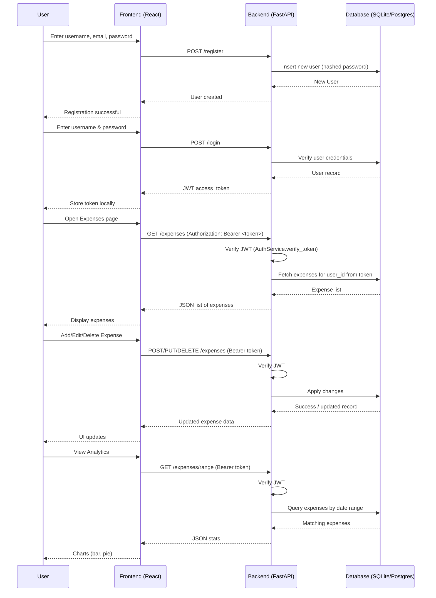
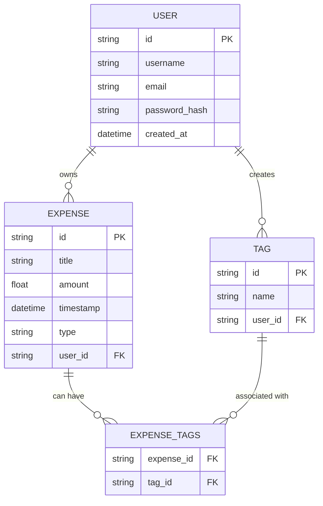

# Expense Management System

A simple **expense management system** built for a DevOps assignment.  
Manage your expenses, track spending over time, and visualize analytics with interactive charts.

---

## Features

- User authentication:
  - Sign up, log in, and log out
  - User-specific data is saved and persisted
- Add, edit, and delete expenses
- Tag expenses for better categorization
- View analytics:
  - Monthly spending bar chart
  - Spending distribution per tag (pie chart)
- Responsive and modern UI

---

## Tech Stack

- **Backend:** FastAPI, SQLAlchemy, SQLite  
- **Frontend:** React, Vite, Chart.js  
- **Authentication:** JWT (JSON Web Tokens) with bcrypt password hashing  
- **Containerization:** Docker & Docker Compose  

---

## Getting Started

### Prerequisites

- Docker
- Docker Compose

### Configure environment variables:
   ```bash
   cd ExpenseManagementSystem/backend
   cp .env.example .env
   ```
- Modify `.env` as needed (e.g., change `SECRET_KEY` for JWT)

### Running tests
```bash
cd ExpenseManagementSystem/backend
venv\Scripts\activate  # On Windows
# source venv/bin/activate  # On macOS/Linux
pip install -r requirements.txt
pytest -v --cov
```
### Running the Application
- To run:
```bash
cd ExpenseManagementSystem
docker-compose up --build -d
```
- To turn off:

```bash
docker-compose down
```

## Diagrams

### Sequence Diagram

### ER Diagram


## Deployment

This project includes CI and Docker artifacts to build, push, and deploy the backend and frontend to Azure App Services using container images.

### Required repository secrets / variables

Add these secrets to your repository (GitHub repo Settings > Secrets):

- `SECRET_KEY` — JWT secret for the backend.
- `ACR_LOGIN_SERVER` — Azure Container Registry login server (e.g. myregistry.azurecr.io).
- `ACR_USERNAME` — ACR username.
- `ACR_PASSWORD` — ACR password.
- `AZURE_CREDENTIALS` — Service principal JSON for `azure/login` action (as JSON string).
- `BACKEND_URL` — Public HTTPS URL for the backend (used to build the frontend and in health checks), e.g. `https://backend-expensemanagement-xxxxx.westeurope-01.azurewebsites.net`
- `FRONTEND_URL` — Public HTTPS URL for the frontend (for CORS configuration), e.g. `https://frontend-expensemanagement-xxxxx.westeurope-01.azurewebsites.net`
- `BACK_END_WEBAPP_NAME` — Azure Web App name for backend.
- `FRONT_END_WEBAPP_NAME` — Azure Web App name for frontend.
- `RESOURCE_GROUP` — Azure resource group containing the Web Apps.

### What `deploy.yml` does

The workflow file `.github/workflows/deploy.yml` implements a CI/CD pipeline that:

1. Runs backend tests (uses `DATABASE_URL="sqlite:///:memory:"` for tests).
2. Builds Docker images for `backend` and `frontend`.
   - Frontend build receives `VITE_API_URL` via a build argument (`BACKEND_URL`) so the built bundle points to the correct backend.
3. Pushes images to Azure Container Registry (`ACR`).
4. Deploys the backend container image to Azure Web App:
   - Sets app settings (including `DATABASE_URL=sqlite:////home/data/expenses.db` for in-container persistence).
   - Configures CORS for the frontend URL.
   - Restarts and waits briefly, then performs a health check.
5. Deploys the frontend container image to Azure Web App:
   - Sets `VITE_API_URL` app setting to the backend URL.
   - Restarts the frontend.

Important notes:
- `WEBSITES_ENABLE_APP_SERVICE_STORAGE=true` is set for the backend so the sqlite database file persists across restarts when supported by the App Service plan. Validate persistence for your plan; for production consider using an external DB (Postgres or Azure Database).
- The workflow uses `BACKEND_URL` and `FRONTEND_URL` secrets to avoid hardcoding environment-specific addresses.

### What `docker-compose.azure.yml` is used for

- `docker-compose.azure.yml` is a convenience compose file that references images from your registry (`${ACR_LOGIN_SERVER}/expense_backend:latest` and `expense_frontend:latest`) and sets environment variables suitable for running the deployed images locally or in a test environment.
- Use it to run the same container images as deployed in Azure, for smoke tests or local validation after pushing images.

Example local steps for validating the Azure images (requires prior `docker login` to ACR):
```bash
# create a .env with ACR login server and SECRET_KEY etc.
docker compose -f docker-compose.azure.yml up --pull always
