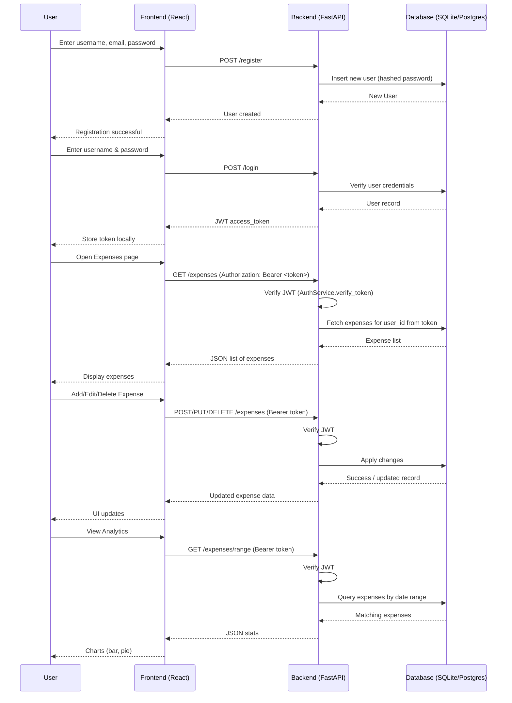
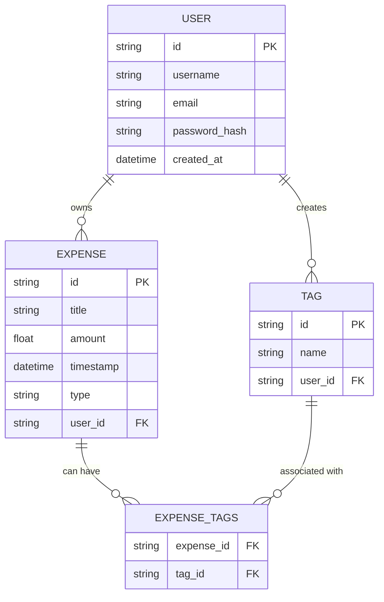

# Expense Management System

A simple **expense management system** built for a DevOps assignment.  
Manage your expenses, track spending over time, and visualize analytics with interactive charts.

---

## Features

- User authentication:
  - Sign up, log in, and log out
  - User-specific data is saved and persisted
- Add, edit, and delete expenses
- Tag expenses for better categorization
- View analytics:
  - Monthly spending bar chart
  - Spending distribution per tag (pie chart)
- Responsive and modern UI

---

## Tech Stack

- **Backend:** FastAPI, SQLAlchemy, SQLite  
- **Frontend:** React, Vite, Chart.js  
- **Authentication:** JWT (JSON Web Tokens) with bcrypt password hashing  
- **Containerization:** Docker & Docker Compose  

---

## Getting Started

### Prerequisites

- Docker
- Docker Compose

### Configure environment variables:**
   ```bash
   cd ExpenseManagementSystem/backend
   cp .env.example .env
   ```
- Modify `.env` as needed (e.g., change `SECRET_KEY` for JWT)

### Running tests
```bash
cd ExpenseManagementSystem/backend
venv\Scripts\activate  # On Windows
# source venv/bin/activate  # On macOS/Linux
pip install -r requirements.txt
pytest -v --cov
```
### Running the Application
- To run:
```bash
cd ExpenseManagementSystem
docker-compose up --build -d
```
- To turn off:

```bash
docker-compose down
```

## Diagrams

### Sequence Diagram

### ER Diagram
